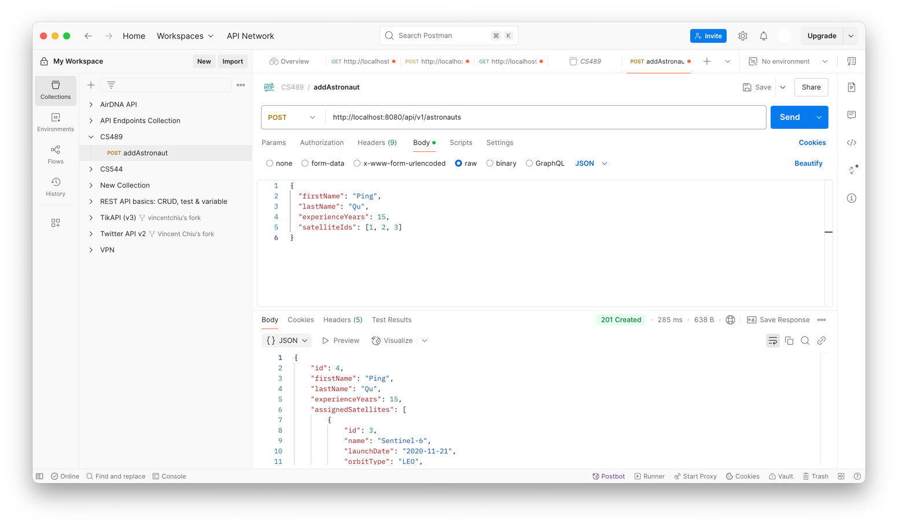
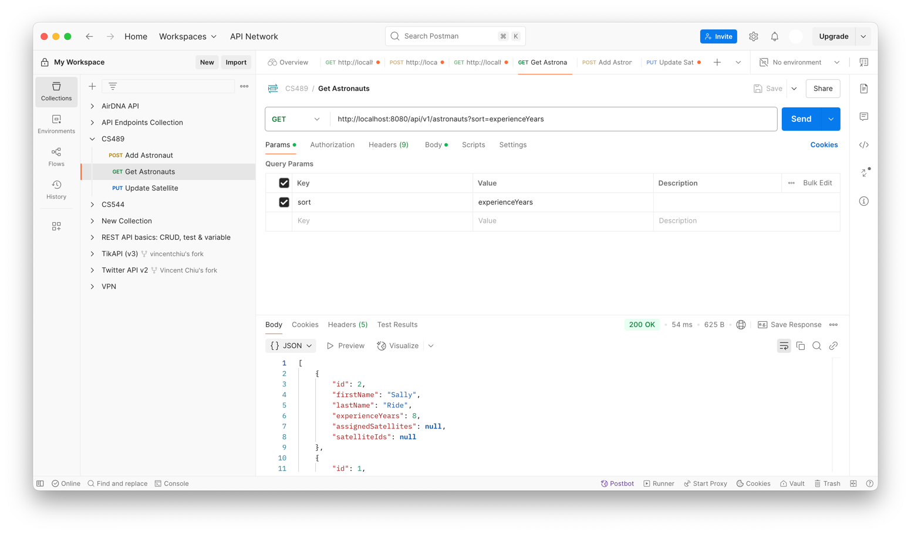
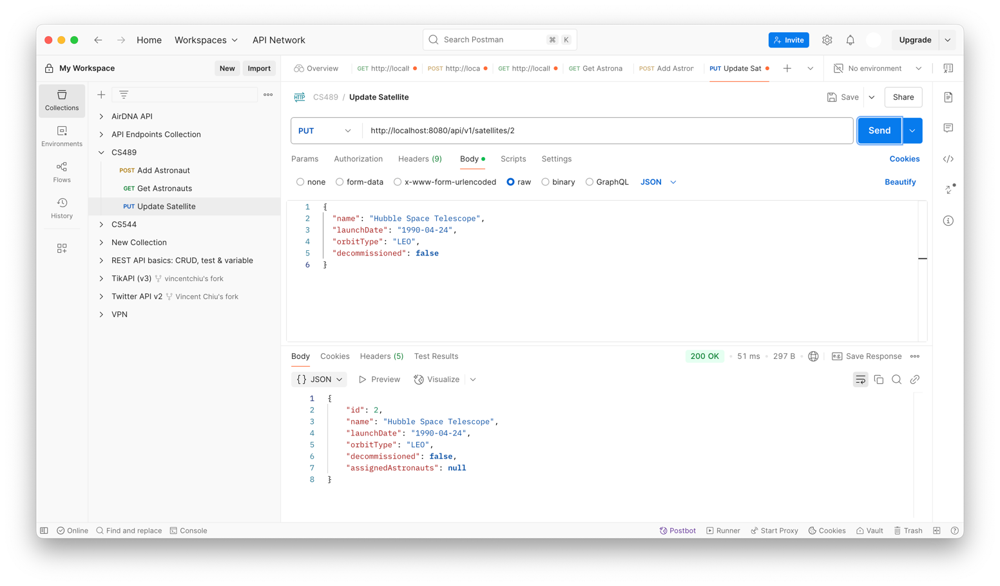

astronaut

|id|experience_years|first_name|last_name|
|--|----------------|----------|---------|
|1|12|Neil|Armstrong|
|2|8|Sally|Ride|
|3|15|Chris|Hadfield|
|4|15|Ping|Qu|

astronaut_satellite

|id|astronaut_id|satellite_id|
|--|------------|------------|
|1|1|1|
|2|1|2|
|3|2|2|
|4|2|3|
|5|3|1|
|6|3|2|
|7|3|3|
|8|4|3|
|9|4|1|
|10|4|2|

satellite

|id|decommissioned|launch_date|name|orbit_type|
|--|--------------|-----------|----|----------|
|1|0|1990-04-24|Hubble|LEO|
|2|0|2023-08-14|Starlink-17|MEO|
|3|1|2020-11-21|Sentinel-6|LEO|
